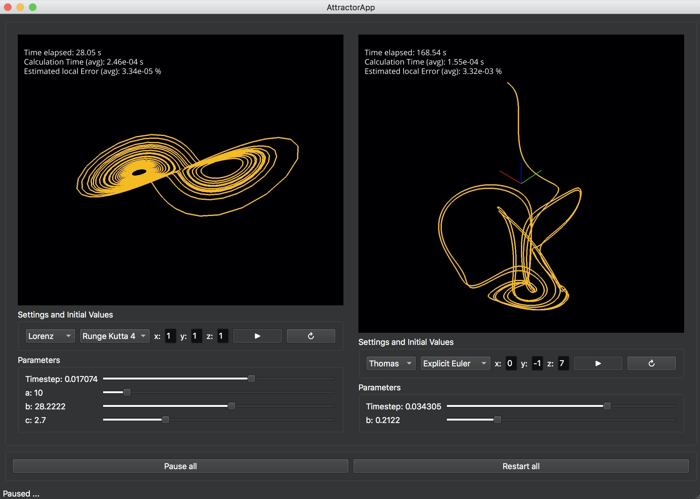

# Attractor-App
Project developed for Python course.

This app lets you explore some strange attractors (e.g. the Lorenz Attractor) which are chaotic systems of differential equations.
Even though they are chaotic, some stationary solutions can be found which are visualized. Sliders can be used to 
tweak the parameters ever so slightly and investigate the big differences that happen from small adjustments of the input (chaotic
system).
Since attractors are differential equations, they must be solved in order to plot them. There are numerous methods of 
solving such equations, some of which are featured in this app. Those can be compared (some of them are faster but less accurate)
and the timestep for the solvers can be adjusted with a slider to get a feeling of how important the right timestep is when 
solving differential equations. The solvers can also be compared in terms of average calculation speed (for one timestep) and
estimated local error occurred during this calculation.

Required packages:
* `PyQt5`
* `vispy`
* `matplotlib`
* `numpy`

